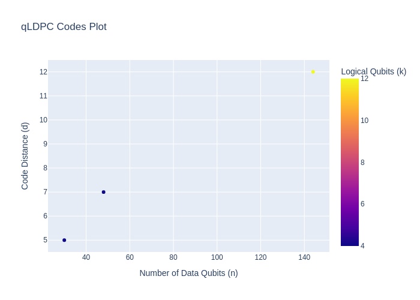

# Awesome qLDPC Codes

This repository gathers theoretical proposals of qLDPC codes.

## Visualizations

### qLDPC Codes Parameters

## Codes List

- **Title**: High-threshold and low-overhead fault-tolerant quantum memory 
  - **DOI**: https://arxiv.org/abs/2308.07915
  - **Parameters**: n=144, k=12, d=12, n_a=?

